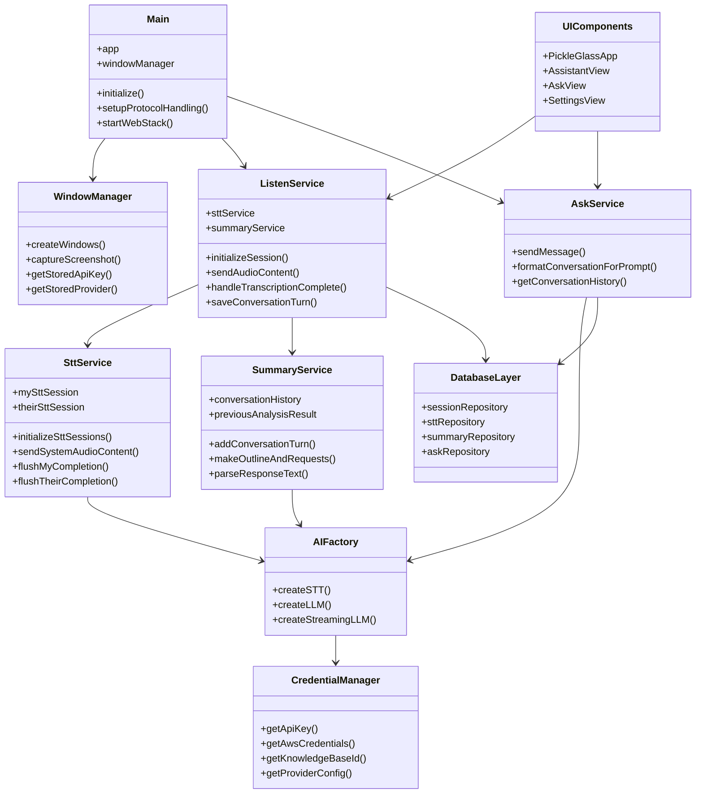
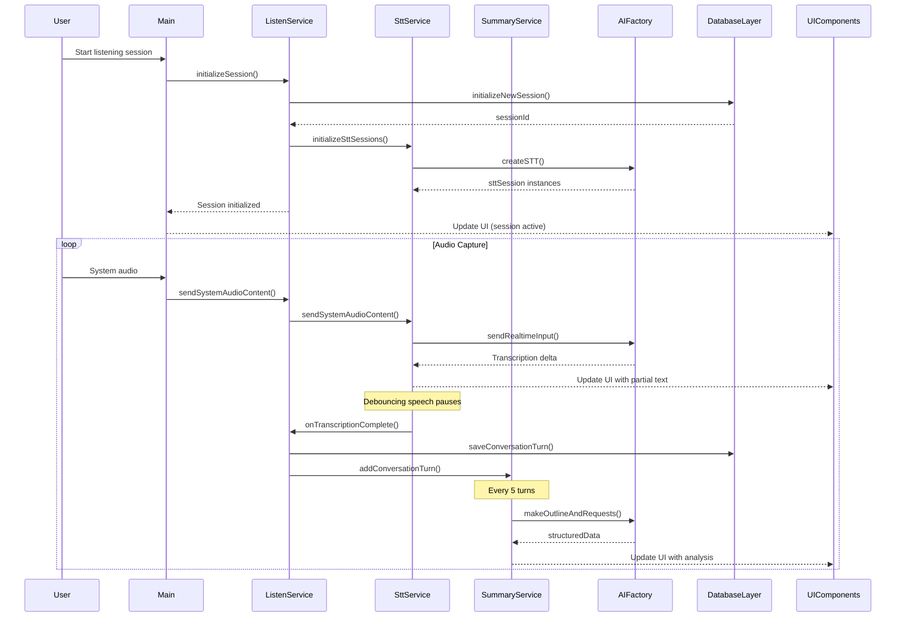
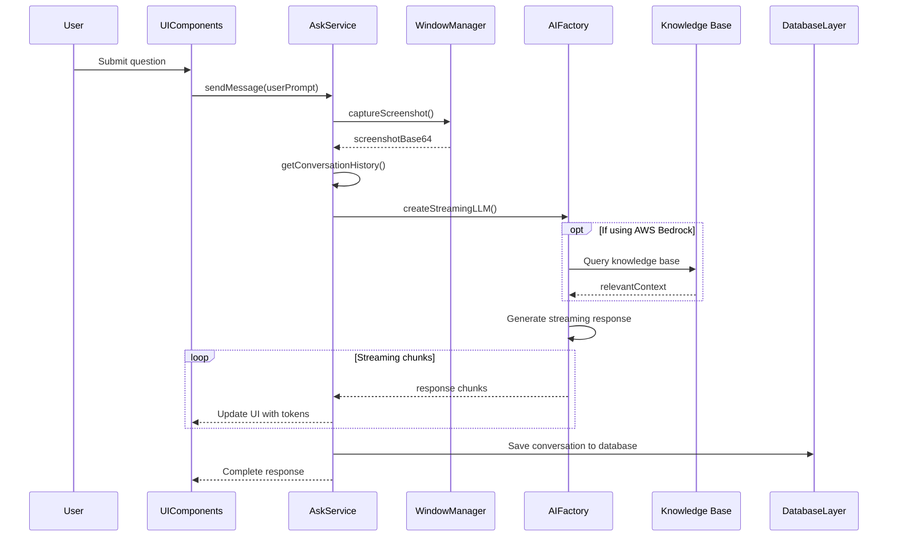

# Glass

A modern application for efficient interaction with audio, visual content, and AI assistance.

## Features

### Core Capabilities
- **Real-time Audio Transcription**: Captures and transcribes system audio with speaker differentiation
- **AI-powered Content Analysis**: Processes captured content with multiple AI providers
- **Intelligent Q&A**: Ask questions about captured content with contextual awareness
- **Multi-provider AI Support**: OpenAI, Gemini, AWS Bedrock/Claude, and Local LLM options
- **Cross-platform**: Support for macOS and Windows (beta)

### Technical Features
- **Electron + Next.js Hybrid Architecture**: Desktop app with web components
- **SQLite Database**: Local storage with optional Firebase sync
- **Keyboard Shortcut Controls**: Quick access to key functionality
- **Knowledge Base Integration**: RAG capabilities through AWS Bedrock
- **Customizable Settings**: Provider selection, language preferences, and more

## Architecture

Glass consists of several interconnected components:

### Core Structure
- **Main Process**: Handles window management, IPC, and core services initialization
- **UI Layer**: LitElement components for desktop and Next.js for web
- **Service Layer**: Modular services for various functionalities
- **Repository Layer**: Data persistence and retrieval

### Data Flow
1. Audio capture → STT transcription → AI processing → UI rendering
2. User queries → LLM processing (with KB enhancement) → Response display
3. Screen content → Visual processing → Context-aware responses

## System Architecture Diagrams

### Low-Level Design Diagram



### Sequence Flow Diagram - Listen Feature



### Sequence Flow Diagram - Ask Feature



## Detailed Implementation

### Listen Feature
The Listen feature captures and transcribes audio in real-time:
- **Dual-Channel Processing**: Separates user audio ("Me") and system audio ("Them")
- **Automatic Speaker Detection**: Identifies and attributes speech to the correct speaker
- **Turn-based Transcription**: Uses debouncing to detect natural speech pauses
- **Native Audio Capture**: Uses platform-specific methods (SystemAudioDump on macOS)

### Ask Feature
The Ask feature provides context-aware responses:
- **Multi-modal Input**: Combines text queries with screenshot context
- **Conversation Memory**: Incorporates previous transcribed conversations
- **Streaming Responses**: Real-time token-by-token display of AI responses
- **Session Management**: Persists conversation history in SQLite database

### Summary Service
Automatically analyzes and summarizes conversations:
- **Periodic Analysis**: Processes conversation after every 5 turns
- **Structured Output**: Extracts topics, key points, and suggested questions
- **Persistent Storage**: Saves summaries for later review
- **Incremental Updates**: Builds upon previous analysis for continuous context

### AI Factory System
The AI provider abstraction layer:
- **Factory Pattern**: Creates appropriate STT, LLM, or streaming LLM instances
- **Provider Flexibility**: Seamlessly switches between OpenAI, Gemini, and AWS Bedrock
- **Credential Management**: Centralized handling of API keys and authentication
- **Fallback Handling**: Automatic provider fallback for unsupported features

### AWS Bedrock Integration
Enhanced AI capabilities through AWS Bedrock:
- **Claude Models**: Support for multiple Claude model versions
- **Knowledge Base**: RAG (Retrieval-Augmented Generation) for enhanced responses
- **Query Optimization**: Preprocessing and expansion for improved KB results
- **Memory Manager**: Maintains conversation context for continuity

### Centralized Credential Management
Secure handling of API keys and credentials:
- **Priority System**: User-entered keys take precedence over environment variables
- **AWS Session Support**: Handles temporary credentials with session tokens
- **Cross-Provider Consistency**: Unified credential approach across services

## AI Integration

Glass supports multiple AI providers through a factory pattern:
- **OpenAI**: Primary provider for STT and chat capabilities
- **Google Gemini**: Alternative LLM provider for content generation
- **AWS Bedrock/Claude**: Enhanced with Knowledge Base integration
- **Local LLM**: Support for self-hosted models like Ollama

## Recent Enhancements

- **AWS Bedrock Integration**: Full support for Claude models with Knowledge Base capabilities
- **Windows Support**: Beta version now available for Windows users
- **Improved Audio Processing**: Enhanced acoustic echo cancellation using Rust
- **Local Model Support**: Run with local language models for privacy
- **Firebase Integration**: Cloud-based data storage and synchronization
- **Customizable Shortcuts**: Personalized keyboard controls

## Getting Started

### Prerequisites
- Node.js 20.x.x


### Installation

```bash
npm run setup
```

### Development Mode

```bash
npm run dev
```

## Project Structure

```
glass/
├── docs/             # Documentation and guides
├── functions/        # Firebase Cloud Functions
├── pickleglass_web/  # Next.js web application
├── public/           # Static assets
├── scripts/          # Utility scripts
├── src/              # Main Electron application
│   ├── app/          # Main application components
│   ├── assets/       # Application resources
│   ├── common/       # Shared utilities and services
│   │   ├── ai/       # AI provider integrations
│   │   ├── config/   # Application configuration
│   │   ├── prompts/  # AI prompt templates
│   │   ├── repositories/ # Data access layer
│   │   ├── services/ # Shared services
│   │   └── utils/    # Utility functions
│   ├── electron/     # Electron-specific code
│   └── features/     # Feature implementations
│       ├── ask/      # AI chat functionality
│       ├── listen/   # Audio transcription
│       └── settings/ # User preferences
└── build.js          # Build configuration
